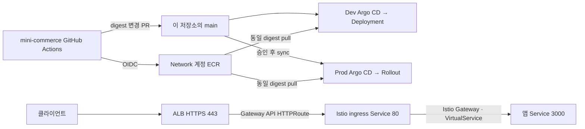

# Mini Commerce GitOps

Mini Commerce의 Kubernetes 배포 상태와 운영 정책을 관리하는 저장소다. **Dev는 Deployment와 자동 동기화, Prod는 Rollout과 승인된 수동 동기화**를 사용한다. 애플리케이션 빌드와 AWS 인프라 상태는 각각 `mini-commerce`, `EKS-infra` 저장소가 소유한다.

GitHub 원본은 [play-builder/argocd-gitops](https://github.com/play-builder/argocd-gitops)다. AWS 계정·ARN·인증서·서비스 도메인은 운영자가 실제 환경 출력으로 등록해야 한다. 현재의 미설정 입력을 실제 서비스 설정으로 간주하면 안 된다. 배포 전 검사는 누락된 입력을 출력하고 실패한다.

- [아키텍처·소유권·디렉터리·발표용 코드 경로](docs/architecture.md)
- [운영 활성화와 검증 절차](docs/operations.md)
- [플랫폼 소유권 인계](argocd/bootstrap/PLATFORM-OWNERSHIP-HANDOFF.md)

## 요청과 배포 흐름

Network 계정의 ECR에서 동일한 image digest를 Dev·Prod 계정의 클러스터가 사용한다. GitOps 변경은 Argo CD가 가져오며, Prod에서는 운영자가 승인된 Git SHA를 선택해 sync한다. 이 저장소의 CI에는 AWS 배포 권한이 없다.



이 그림에서 봐야 할 핵심: 이미지 배포와 요청 경로는 독립적이다. ALB의 backend는 앱이 아니라 `istio-ingress-stable:80`이며, 앱의 management 포트 `3001`은 외부 Service에 노출되지 않는다.

## 저장소 구조

운영 도구와 검증은 배포·복구 동작을 기준으로 구분한다. Shell은 CLI 조합, Ruby는 YAML/정책 검증, jq는 증빙 데이터 검증에 사용한다. 확장자가 아니라 실제 장애·회귀를 탐지하는지가 유지 기준이다.

| 경로 | 책임 |
|---|---|
| `argocd/bootstrap/{dev,prod}` | 환경별 ApplicationSet, AppProject, Namespace, SecretStore 인계 |
| `argocd/overlays` | 검증 후 PSS·Sigstore·mesh 활성화 |
| `charts/mini-commerce` | 앱, migration Job, Service, HPA/PDB, native Istio routing·analysis |
| `charts/mini-commerce-db-dev` | 독립된 Dev PostgreSQL·retained PVC·snapshot 캡처 |
| `charts/mini-commerce-recovery` | 별도 namespace의 snapshot 검사 |
| `envs/{dev,prod}` | 이미지, 환경 설정, 승인된 migration·cleanup 단계 |
| `platform/istio`, `platform/security` | mesh·ALB Gateway API·입장 정책·quota |
| `scripts` | 설정 렌더링, 승격 검증, 증빙 수집·복구 안전장치 |
| `tests` | activation과 이미지 승격 정책 두 가지 검사 |
| `contracts` | 플랫폼 image mirror에 필요한 고정 인터페이스 |
| `docs/runbooks` | sync, incident, 소유권 인계, 복구 절차 |
| `versions.lock.yaml`, `.github` | 호환 버전·checksum, 독립 CI, 리뷰 소유권 |

## 배포 전 확인

먼저 [운영 활성화](docs/operations.md)의 순서대로 실제 EKS 출력, private ECR digest, source signing key, CODEOWNERS와 서비스 도메인을 설정한다. 아래 명령은 로컬 입력만 검사한다.

```bash
ruby scripts/validate-activation.rb dev
ruby scripts/validate-activation.rb prod
```

`STATIC_VERIFIED`는 입력/렌더링 검증 성공이다. IAM, admission, TLS, 알림, RDS 복구, 트래픽 전환이 실제로 성공했다는 의미는 아니다. 최초 설치와 기존 리소스 소유권 인계는 다른 절차이며, 기존 Namespace·PVC·PV·snapshot 이름을 일괄 변경하면 안 된다.

## 로컬·CI 검증

핵심 요약: Helm/Kustomize 렌더링과 엄격한 CRD 스키마 검사, 두 가지 정책 회귀 검사로 구성한다.

도구: Helm 4.2.4, kubectl 1.36.0, yq 4.53.6, kubeconform 0.7.0, Ruby, jq, Git, curl. `CHART_CACHE_DIR` archive는 lock의 checksum과 chart identity를 검증한다.

```bash
make validate test
make package
```

`validate`는 chart lint와 실제 Helm/Kustomize 렌더링, kubeconform 검사를 수행한다. `test`는 미설정 입력·잘못된 경로 활성화와 Prod digest 우회를 거부하는지 확인한다. 클러스터에는 접속하지 않는다. `package`는 세 chart와 SHA-256 sidecar를 생성한다.

## 앱 변경이 배포되는 과정

핵심 요약: Actions가 이미지를 만들고 GitOps를 갱신한다. Argo CD는 이 저장소의 변경을 감지한다.

1. `mini-commerce` main CI가 테스트·이미지 빌드·ECR push·scan·attestation을 수행한다.
2. GitHub App이 이 저장소의 `envs/dev/values.yaml`에 app/migration digest 변경 PR을 만든다. 검증을 통과한 PR을 자동 merge한다.
3. Dev Argo CD가 main을 감지해 자동 sync한다. 운영자는 Deployment·요청·Istio·지표/로그/trace를 확인한다.
4. Prod는 성공한 CI run/attempt를 선택해 승인 PR을 만든다. PR 검사는 **base main에 이미 있던 Dev digest**와 최종 Helm render를 비교한다.
5. 승인·merge 후 운영자가 Argo CD를 수동 sync한다. Rollouts가 Istio 가중치와 AMP 분석으로 canary를 진행한다.

Dev 건강 상태·SLO는 승인자가 확인한다. 별도 JSON 증빙 조립이나 증빙 게시 PR은 없다. CI 성공만으로 Dev 배포가 정상이라고 판단하지 않는다. 상세 명령은 [운영 절차](docs/operations.md)에 있다.

[Argo CD 자동 동기화](https://argo-cd.readthedocs.io/en/stable/user-guide/auto_sync/)는 Git의 desired state를 감지하므로 앱 CI에 Kubernetes 배포 자격 증명을 넣을 필요가 없다.
