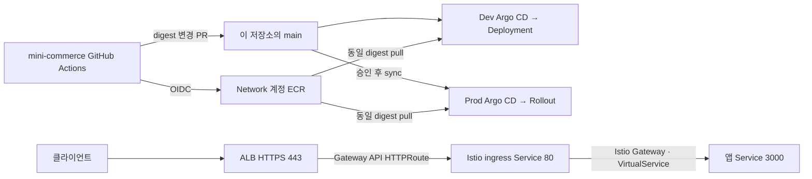

# Mini Commerce GitOps

Mini Commerce의 Kubernetes 배포 상태와 운영 정책을 관리하는 저장소다. **Dev는 Deployment와 자동 동기화, Prod는 Rollout과 승인된 수동 동기화**를 사용한다. 애플리케이션 빌드와 AWS 인프라 상태는 각각 `mini-commerce`, `EKS-infra` 저장소가 소유한다.

GitHub 원본은 [play-builder/argocd-gitops](https://github.com/play-builder/argocd-gitops)다. AWS 계정·ARN·인증서·서비스 도메인은 운영자가 실제 환경 출력으로 등록해야 한다. 현재의 미설정 입력을 실제 서비스 설정으로 간주하면 안 된다. 배포 전 검사는 누락된 입력을 출력하고 실패한다.

- [아키텍처·소유권·디렉터리·발표용 코드 경로](docs/architecture.md)
- [운영 활성화와 검증 절차](docs/operations.md)
- [플랫폼 소유권 인계](argocd/bootstrap/PLATFORM-OWNERSHIP-HANDOFF.md)

## 요청과 배포 흐름

Network 계정의 ECR에서 동일한 image digest를 Dev·Prod 계정의 클러스터가 사용한다. GitOps 변경은 Argo CD가 가져오며, Prod에서는 운영자가 승인된 Git SHA를 선택해 sync한다. 이 저장소의 CI에는 AWS 배포 권한이 없다.



이 그림에서 봐야 할 핵심: 이미지 배포와 요청 경로는 독립적이다. ALB의 backend는 앱이 아니라 `istio-ingress-stable:80`이며, 앱의 management 포트 `3001`은 외부 Service에 노출되지 않는다.

## 저장소 구조

운영 도구와 검증은 배포·복구 동작을 기준으로 구분한다. Shell은 CLI 조합, Ruby는 YAML/정책 검증, jq는 증빙 데이터 검증에 사용한다. 확장자가 아니라 실제 장애·회귀를 탐지하는지가 유지 기준이다.

| 경로 | 책임 |
|---|---|
| `argocd/bootstrap/{dev,prod}` | 환경별 ApplicationSet, AppProject, Namespace, SecretStore 인계 |
| `argocd/overlays` | 검증 후 PSS·Sigstore·mesh 활성화 |
| `charts/mini-commerce` | 앱, migration Job, Service, HPA/PDB, native Istio routing·analysis |
| `charts/mini-commerce-db-dev` | 독립된 Dev PostgreSQL·retained PVC·snapshot 캡처 |
| `charts/mini-commerce-recovery` | 별도 namespace의 snapshot 검사 |
| `envs/{dev,prod}` | 이미지, 환경 설정, 승인된 migration·cleanup 단계 |
| `platform/istio`, `platform/security` | mesh·ALB Gateway API·입장 정책·quota |
| `scripts` | 설정 렌더링, 승격 검증, 증빙 수집·복구 안전장치 |
| `tests`, `contracts` | 동작 회귀·schema·저장소 간 명시적 인터페이스 |
| `docs/runbooks` | sync, incident, 소유권 인계, 복구 절차 |
| `versions.lock.yaml`, `.github` | 호환 버전·checksum, 독립 CI, 리뷰 소유권 |

## 배포 전 확인

먼저 [운영 활성화](docs/operations.md)의 순서대로 실제 EKS 출력, private ECR digest, source signing key, CODEOWNERS와 서비스 도메인을 설정한다. 아래 명령은 로컬 입력만 검사한다.

```bash
ruby scripts/validate-activation.rb dev
ruby scripts/validate-activation.rb prod
```

`STATIC_VERIFIED`는 입력/렌더링 검증 성공이다. IAM, admission, TLS, 알림, RDS 복구, 트래픽 전환이 실제로 성공했다는 의미는 아니다. 최초 설치와 기존 리소스 소유권 인계는 다른 절차이며, 기존 Namespace·PVC·PV·snapshot 이름을 일괄 변경하면 안 된다.

## 로컬·CI 검증

`versions.lock.yaml`의 도구를 설치한다: Helm 4.2.4, kubectl 1.36.0, yq 4.53.6, kubeconform 0.7.0, CUE 0.12.1, istioctl 1.31.0, promtool 3.14.0. Ruby, Node.js, Python 3, jq, Git, curl, ripgrep도 필요하다. `CHART_CACHE_DIR`의 archive는 사용 전에 lock의 checksum과 chart identity를 검사한다.

```bash
bash tests/test-all.sh
```

CI는 같은 suite에서 chart와 CRD schema, 실제 PromQL 평가, tenancy, admission, migration·snapshot·rollback·증빙 수집 실패 경로를 검증한다. AWS/Kubernetes 리소스를 변경하지 않는다. 앱 저장소를 제공하지 않은 기본 실행에서는 **앱의 rollback verifier 호출만 명시적으로 생략**하며 GitOps 자체 테스트는 모두 실행한다.

호환성을 릴리스 단위로 확인할 때는 검토한 앱 checkout의 정확한 commit을 지정한다. `SAMPLE_APP_*`는 기존 자동화와 호환되는 인터페이스 이름이다.

```bash
CROSS_REPO_CONTRACT_MODE=exact-sha \
SAMPLE_APP_REPO_ROOT=/absolute/path/to/clean/mini-commerce \
SAMPLE_APP_EXPECTED_SHA=FULL_40_CHARACTER_APPLICATION_COMMIT_SHA \
bash tests/test-all.sh
```

GitHub의 `validate` workflow 수동 실행에도 `application_sha` 입력을 제공했다. SHA를 비우면 저장소 단독 검사, 지정하면 그 commit을 checkout해 추가 검증한다. private 앱 저장소는 읽기 전용 `CROSS_REPO_READ_TOKEN`이 필요할 수 있다. 일반 PR/main CI가 다른 저장소의 최신 상태에 의존하지 않도록 유지한다.

```bash
bash scripts/package-chart.sh /tmp/mini-commerce-package
```

세 chart package와 SHA-256 sidecar가 생성된다. `evidence/`의 실제 incident·cluster metadata와 로컬 package는 Git에서 제외하며, 승인된 보관 경로에 원본·checksum·companion을 함께 보존한다.
