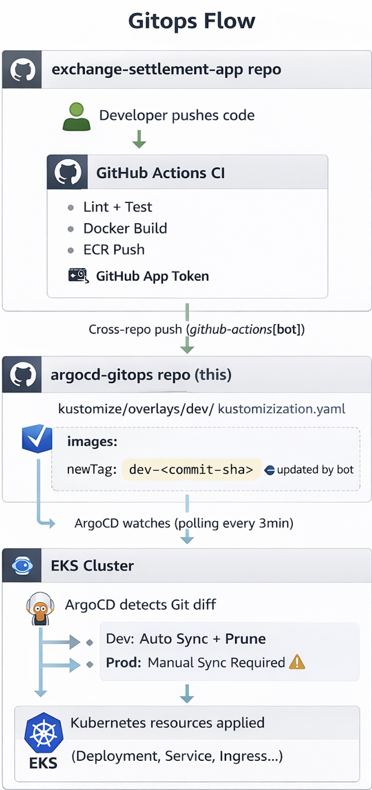

# ArgoCD GitOps

Kubernetes manifest repository implementing the GitOps pattern with ArgoCD ApplicationSet, Git File Generator, Kustomize overlays, and automated deployment pipelines.

## Gitops Flow



## Architecture

### ApplicationSet + Git File Generator

Single `bootstrap.yaml` manages all ApplicationSets, which auto-generate per-environment Applications from JSON config files.

### Sync Wave Order

| Wave | Component | Purpose |

| 1 | External Secrets Operator | CRDs + Controller + IRSA |
| 2 | Ingress NGINX | Load balancer + Security headers |
| 3 | exchange-settlement | Application workloads |
| 4 | ArgoCD Ingress | ArgoCD UI access routes |

### Environment Configuration

All environment-specific values are centralized in JSON config files:

```
argocd/appsets/envs/
├── dev.json    # Dev: automated sync, minimal resources, webhook disabled
└── prod.json   # Prod: manual sync, HA resources, webhook enabled
```

Adding a new environment (e.g., staging) requires only:

1. `argocd/appsets/envs/staging.json`
2. `argocd/projects/staging-project.yaml`
3. `kustomize/overlays/staging/`
4. `argocd/manifests/staging/argocd-ingress/`

## Deployment Verification

```bash
# Check bootstrap and ApplicationSets
kubectl get application bootstrap -n argocd
kubectl get applicationsets -n argocd

# Check all generated Applications
kubectl get applications -n argocd

# Expected output:
# NAME                       SYNC STATUS   HEALTH STATUS
# bootstrap                  Synced        Healthy
# exchange-settlement-dev    Synced        Healthy
# exchange-settlement-prod   Synced        Healthy
# external-secrets-dev       Synced        Healthy
# external-secrets-prod      Synced        Healthy
# ingress-nginx-dev          Synced        Healthy
# ingress-nginx-prod         Synced        Healthy
# argocd-ingress-dev         Synced        Healthy
# argocd-ingress-prod        Synced        Healthy

# Check app pods
kubectl get pods -n app-dev
kubectl get pods -n app-prod

# Check deployed image tag
kubectl get pods -n app-dev -o jsonpath='{.items[0].spec.containers[0].image}'

# Verify security headers applied by ingress-nginx
curl -sI https://playbuilder.xyz | grep -iE "strict-transport|x-frame|x-content-type"
```

## Tech Stack

| Component                 | Version       | Purpose                             |
| ------------------------- | ------------- | ----------------------------------- |
| ArgoCD                    | 7.7.16 (Helm) | GitOps continuous delivery          |
| ArgoCD ApplicationSet     | v2.9+         | Multi-env Application generation    |
| Kustomize                 | 5.4.3         | Manifest templating with overlays   |
| External Secrets Operator | 0.14.2        | AWS Secrets Manager → K8s Secrets   |
| Ingress-NGINX             | 4.11.3        | Kubernetes ingress controller + NLB |

## Related Repositories

| Repository                                                                               | Purpose                               |
| ---------------------------------------------------------------------------------------- | ------------------------------------- |
| [eks-terraform-provisioning](https://github.com/play-builder/eks-terraform-provisioning) | EKS infrastructure (Terraform)        |
| [exchange-settlement-app](https://github.com/play-builder/exchange-settlement-app)       | Node.js application + CI/CD workflows |
