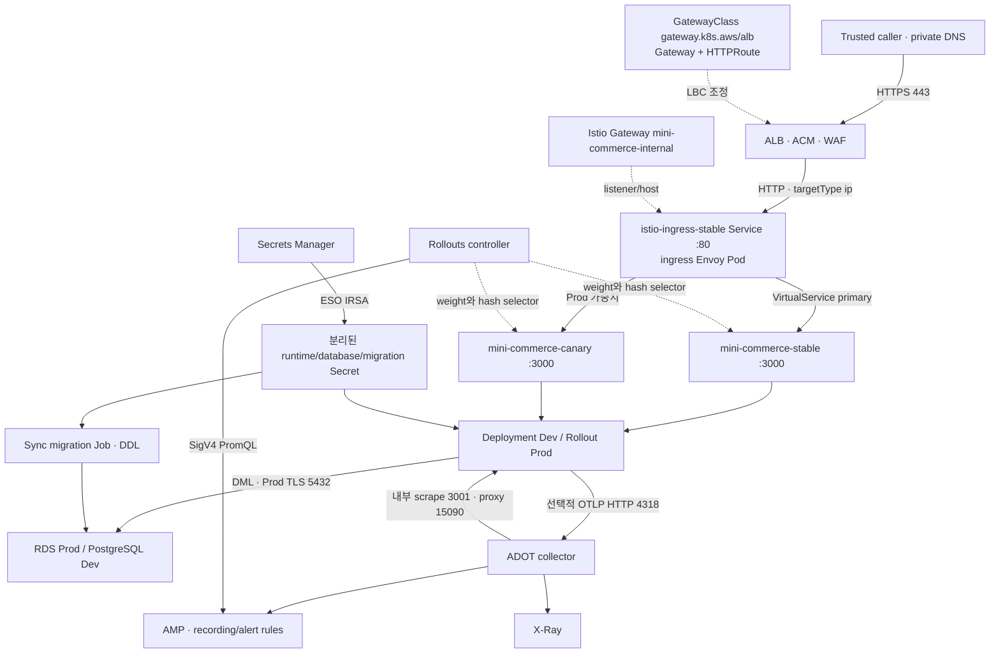
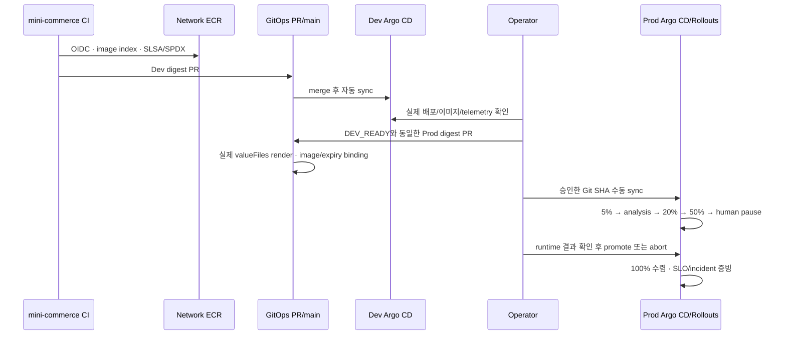

# GitOps·트래픽·배포 운영 아키텍처

이 문서는 현재 manifest와 실행 코드를 설명한다. 설계된 보호 장치, 로컬에서 검증 가능한 범위, 실제 클러스터에서 입증해야 하는 동작을 분리한다. 발표에서는 `main`의 commit SHA와 사용한 검증 결과를 함께 제시한다.

## 목차

1. [소유권과 계정 경계](#소유권과-계정-경계)
2. [요청·데이터·관측 경로](#요청데이터관측-경로)
3. [빌드에서 Prod 승격까지](#빌드에서-prod-승격까지)
4. [폴더와 코드 읽기 순서](#폴더와-코드-읽기-순서)
5. [운영 규모별 선택](#운영-규모별-선택)
6. [검증 범위와 남은 조건](#검증-범위와-남은-조건)

## 소유권과 계정 경계

**핵심 요약:** Network 계정은 이미지 유통, Dev·Prod 계정은 각각의 실행 환경을 담당한다. 같은 ECR을 사용해도 EKS 계정이 같을 필요는 없다. 한 리소스를 Terraform과 Argo CD가 동시에 관리하지 않도록 소유권을 나눈다.

| 소유자 | 소유 리소스·코드 | 이 저장소의 소비 방식 |
|---|---|---|
| `EKS-infra` | VPC/EKS/IAM, Network ECR·OIDC, RDS, AMP/ADOT/X-Ray, Argo CD/Rollouts·LBC controller, Sigstore controller | 실제 outputs, controller/CRD, RBAC·IRSA handoff |
| `mini-commerce` | Node.js API·health/metrics, SQL migration ledger, 이미지·SLSA/SPDX attestation | 동일한 ECR index digest와 DEV_READY |
| `argocd-gitops` | 앱 desired state, Istio 버전별 설치·정책, AWS Gateway API 리소스, workload admission·quota, promotion/incident binding | Git PR → Argo CD render/reconcile |
| 운영자 | 계정 접근, source signing keys, DNS·인증서, GitHub 규칙, 승인·runtime 증빙·복구 훈련 | 명시적인 입력과 runbook |

각 클러스터의 Argo CD가 자신의 `https://kubernetes.default.svc`로 배포한다. 이 주소가 같다고 Dev·Prod 클러스터가 같은 것은 아니다. 클러스터 경계는 EKS ARN과 실제 Kubernetes API endpoint로 검증한다. 중앙 ECR repository URL은 별도로 승인된 Network 계정 output과 대조한다.

EKS는 LBC controller를 설치하지만, 새 ALB는 GitOps의 `GatewayClass`·`Gateway`·`HTTPRoute`를 읽은 LBC가 조정한다. 기존 Terraform 소유 ALB/Gateway/Namespace는 소유권 인계가 끝날 때까지 기존 이름·state address를 보존한다. 실제 legacy 소유권을 GitHub 저장소 이름 변경과 혼동하지 않는다.

## 요청·데이터·관측 경로

**핵심 요약:** 현재 internal edge는 Kubernetes `Ingress`가 아니라 AWS Gateway API다. ALB가 TLS를 종료하고 Istio ingress로 전달한다. 앱 데이터와 management telemetry는 별도 경로를 사용한다.

이 그림에서 봐야 할 핵심: `HTTPRoute`와 `VirtualService`는 다른 구간을 제어한다. RDS DML과 migration DDL의 Secret/reader를 분리하며, 3001 management 접근은 internal edge를 통과하지 않는다.

### Edge의 실제 리소스

`platform/istio/overlays/{dev,prod}/policies.yaml`에 다음 연결이 선언돼 있다.

| 구간 | 실제 객체·설정 |
|---|---|
| AWS listener | `gateway.networking.k8s.io/v1` Gateway `istio-system/mini-commerce-mesh`, HTTPS 443 |
| LBC 설정 | GatewayClass `mini-commerce-mesh-alb-{dev,prod}`, controller `gateway.k8s.aws/alb` |
| WAF/TLS | `LoadBalancerConfiguration/mini-commerce-mesh`의 WAF ACL·ACM certificate |
| ALB backend | `HTTPRoute/mini-commerce-mesh` → `istio-ingress-stable:80`, PathPrefix `/` |
| Target group | `TargetGroupConfiguration/istio-ingress-stable`, IP targets, HTTP, health `15021/healthz/ready` |
| Istio listener | `networking.istio.io/v1` Gateway `mini-commerce-internal`, stable ingress selector, HTTP 80 |
| 앱 route | `VirtualService/mini-commerce`, gateway `istio-system/mini-commerce-internal`, named route `primary` |
| 최종 서비스 | `mini-commerce-stable`·`mini-commerce-canary`, 앱의 `public` container port 3000 |

Prod의 `Rollout` controller가 Service의 `rollouts-pod-template-hash` selector와 `primary`의 weight를 변경한다. Argo CD는 이 controller 소유 필드만 좁게 ignore한다. ingress stable/candidate는 Istio 업그레이드 경로이고, 앱 stable/canary와 구별한다. 현재 internal edge는 stable ingress에 연결된다.

3001은 Service에 포함되지 않는다. kubelet probe는 Istio rewrite를 사용하며, ADOT는 NetworkPolicy의 namespace+Pod selector로 제한된 scrape를 사용한다. management `/metrics`에는 별도 `AuthorizationPolicy`가 있고 해당 포트의 mTLS는 명시적으로 `DISABLE`이다. 따라서 management scrape를 종단 간 mTLS라고 발표하면 안 된다. 실제 CNI 집행과 node-origin probe 동작은 클러스터에서 확인해야 한다.

### 데이터와 복구

`charts/mini-commerce`는 DB 서버/PVC를 만들지 않는다. Prod DB의 소유자는 EKS/RDS이며, 별도 `mini-commerce-db-dev` chart만 Dev PostgreSQL을 관리한다. migration Job은 non-root·read-only root filesystem·별도 DDL Secret을 사용한다. Prod 앱과 migration에 `DB_SSL=true`, AWS CA bundle, 명시적 private RDS CIDR을 주입한다.

migration은 `initial/001 → expand/002 → contract/003 → finalize/003` 계약을 가진다. 일상적인 앱 승격과 파괴적 schema 축소는 별도 승인이다. contract 단계는 실제 Rollout UID·ReplicaSet hash·revision·image·시간에 묶인 rollback 후보가 있어야 한다. 후보 ConfigMap의 생성·삭제는 `capture-rollback-candidates-evidence.sh`의 명시적 운영 동작이다.

Dev snapshot 검사는 retained EBS snapshot을 별도 `app-recovery` PVC로 연결해 `PG_VERSION`을 확인한다. 이것만으로 SQL 데이터 무결성, RPO/RTO 또는 Prod RDS PITR을 입증하지 않는다. `data-mini-commerce-postgresql-0` 같은 실제 retained identity와 Phase A/B 소유권 guard는 유지한다.

## 빌드에서 Prod 승격까지

**핵심 요약:** 애플리케이션 CI가 이미지를 만들고, GitOps는 승인된 digest를 배포한다. Repo별 CI는 독립적이며 릴리스의 교차 호환성 검사는 정확한 앱 SHA를 명시할 때 추가된다.

이 그림에서 봐야 할 핵심: Git merge와 Prod traffic promotion은 별개 승인이다. GitHub의 초록색 CI 표시는 Dev 실제 관측이나 Prod 복구 완료를 대신하지 않는다.

`scripts/verify-prod-promotion-binding.sh`는 PR base와 현재 chart를 ApplicationSet의 실제 valueFiles 순서로 렌더링한다. 앱/migration 이미지 변경은 유효한 DEV_READY와 일치해야 하며, inline Helm parameters/valuesObject는 이 앱의 승인된 인터페이스가 아니므로 거부한다. 구성-only 변경, 동일 이미지의 migration 활성화, cleanup은 새 이미지 승격과 구분한다. [Argo CD Helm 우선순위](https://argo-cd.readthedocs.io/en/latest/user-guide/helm/) 때문에 기본 values 파일만 검사하는 것으로는 충분하지 않다.

Prod AnalysisTemplate은 canary hash로 제한한 request-rate, success-rate, p95 latency를 AMP에 질의한다. 측정 빈도·횟수·허용 실패 수는 values에 선언돼 있다. `capture-prod-slo-evidence.sh`는 terminal Rollout, 실제 ReplicaSet 소유권·이미지, 100/0 routing, AnalysisRun revision·latest-hash, 완료된 최근 측정값을 검증한다. Prometheus singleton vector를 기존 evidence v1 scalar string으로 정규화한다. [Argo Rollouts v1.9.1의 실제 직렬화 구현](https://github.com/argoproj/argo-rollouts/blob/v1.9.1/metricproviders/prometheus/prometheus.go)을 기준으로 처리한다.

## 폴더와 코드 읽기 순서

**핵심 요약:** 발표는 ingress → workload → delivery → safety 순서로 코드를 보여주면 흐름이 연결된다. tests는 구현 파일 수를 설명하기 위한 장식이 아니라 중요한 운영 실패를 재현하는 실행 자료다.

| 순서 | 코드 | 설명할 동작 |
|---|---|---|
| 1 | `platform/istio/overlays/prod/policies.yaml` | Gateway API, Istio Gateway, NetworkPolicy·mTLS |
| 2 | `charts/mini-commerce/templates/workload.yaml`, `istio-routing.yaml` | Rollout과 stable/canary 관계 |
| 3 | `analysistemplate.yaml`, `telemetry.yaml` | canary hash, PromQL과 관측 label |
| 4 | `argocd/bootstrap/prod/mini-commerce.yaml`, `project.yaml` | 실제 repo URL, valueFiles, sync/RBAC 경계 |
| 5 | `scripts/verify-prod-promotion-binding.sh`, `render-prod-release.rb` | override를 포함한 release identity 검증 |
| 6 | `migration-job.yaml`, `scripts/capture-rollback-candidates-evidence.sh` | DDL credential·rollback 후보 binding |
| 7 | `scripts/capture-prod-slo-evidence.sh`, `scripts/lib/publish-incident-capture.rb` | 실제 provider 응답과 write-once incident/DR binding |
| 8 | `tests/test-all.sh`, `.github/workflows/validate.yml` | 로컬·CI 동일 suite, exact-SHA opt-in |

삭제한 항목은 사용되지 않는 이전 network-policy/recovery fixture 10개, 앱 chart에서 소비하지 않던 DB 서버·networkPolicy·manualPromotion 설정과 helper 3개, 별도 suite와 겹치던 CI의 textual rollback-window 검사를 포함한다. Namespace/PVC/snapshot 및 실제 소유권 인계 guard는 삭제하지 않았다. cleanup flag는 앱 소유 desired resources를 실제로 제거하도록 연결했고, retained Namespace와 별도 데이터 chart는 보존한다.

## 운영 규모별 선택

**핵심 요약:** 팀 규모와 규제 요건에 따라 운영 비용을 결정한다. 현재 구성을 사용하려면 mesh·canary·데이터 복구의 운영 주체를 지정해야 하며, 단순화를 원할 때는 지원하지 않는 값을 끄는 대신 별도 아키텍처 변경을 검토한다.

| 관점 | 소규모 운영 | 엔터프라이즈 운영 |
|---|---|---|
| 책임 | 소수 on-call, 최소 승인자, 문서화된 복구 | 앱·플랫폼·보안 분리, CODEOWNERS/SSO 그룹 |
| 계정 | blast radius를 검토한 계정 수 결정 | Network registry와 Dev/Prod 접근·감사 분리 |
| 가용성 | 필요한 RTO와 유지 비용부터 선택 | Prod 3+ replica, zone/node spread, HPA, PDB, controller HA |
| Mesh | 현재 chart는 Istio 의존; 제거는 별도 설계 | revision upgrade·admission·telemetry 전담 운영 |
| 분석 | 저트래픽이면 0.1 req/s floor 충족 방안 필요 | 실제 canary traffic·SLO·알림·abort 훈련 |
| 데이터 | 관리형 DB 중심, 정기 restore 확인 | DML/DDL 분리, PITR, evidence retention, RPO/RTO 측정 |

`DoNotSchedule` topology spread는 부족한 zone/node 용량에서 배포를 막을 수 있다. strict admission/서명은 잘못된 설정에서 정상 복구까지 차단할 수 있으므로 별도 break-glass와 restore 훈련이 필요하다. replica 수와 모든 보안 장치를 그대로 유지하면서 비용만 작은 구성은 제공하지 않는다.

## 검증 범위와 남은 조건

**핵심 요약:** 로컬 suite는 manifest·정책·실패 경로를 검증한다. 운영 활성화에는 실제 계정 설정과 live 증빙이 필요하다. 검증 결과는 사용한 commit과 입력에만 적용된다.

| 검증 | 확정할 수 있는 것 | 확정하지 못하는 것 |
|---|---|---|
| Helm·Kustomize·upstream CRD schema | 렌더링, 타입·필드, chart checksum | controller reconcile·webhook 집행 |
| Promtool·CLI fixtures | PromQL 결과, malformed/stale/foreign evidence 거부 | 실제 AMP label·IAM·접속·시간 지연 |
| exact-SHA 앱 검사 | 해당 앱 migration verifier와 GitOps 계약 호환 | 실제 PostgreSQL/RDS schema·데이터 |
| activation 입력 검사 | placeholder, ECR identity, hostname·RDS egress 설정 | 인증서 소유·DNS·network route·AWS 권한 |
| live 승인 gate | 별도 운영자가 기록한 배포·알림·복구 결과 | 실행하지 않은 환경이나 미래 변경 |

최초 baseline collector는 revision 1 onboarding 증빙이다. 재설치·다른 Rollout UID·기존 baseline 교체를 일상적인 재실행으로 처리하지 않고 원본을 보관한 뒤 승인된 재기준 설정 절차를 거친다. SLO 성공 측정값은 capture 시각 기준 30분 이내여야 하며 오래된 결과를 다시 찍어 최신 runtime 증빙으로 만들지 않는다.

전체 환경 teardown 수집기는 단일 AWS 계정의 ownership inventory 계약을 유지한다. **분리된 Dev/Prod 계정 전체 삭제 도구로 사용할 수 없다.** 기존 guard를 해제하지 말고 계정별 Terraform/state·provider-secret 보존 계획을 따로 검토한다. 일반 배포·승격의 cross-account ECR 지원과 전체 teardown의 계정 범위는 별개의 계약이다.
